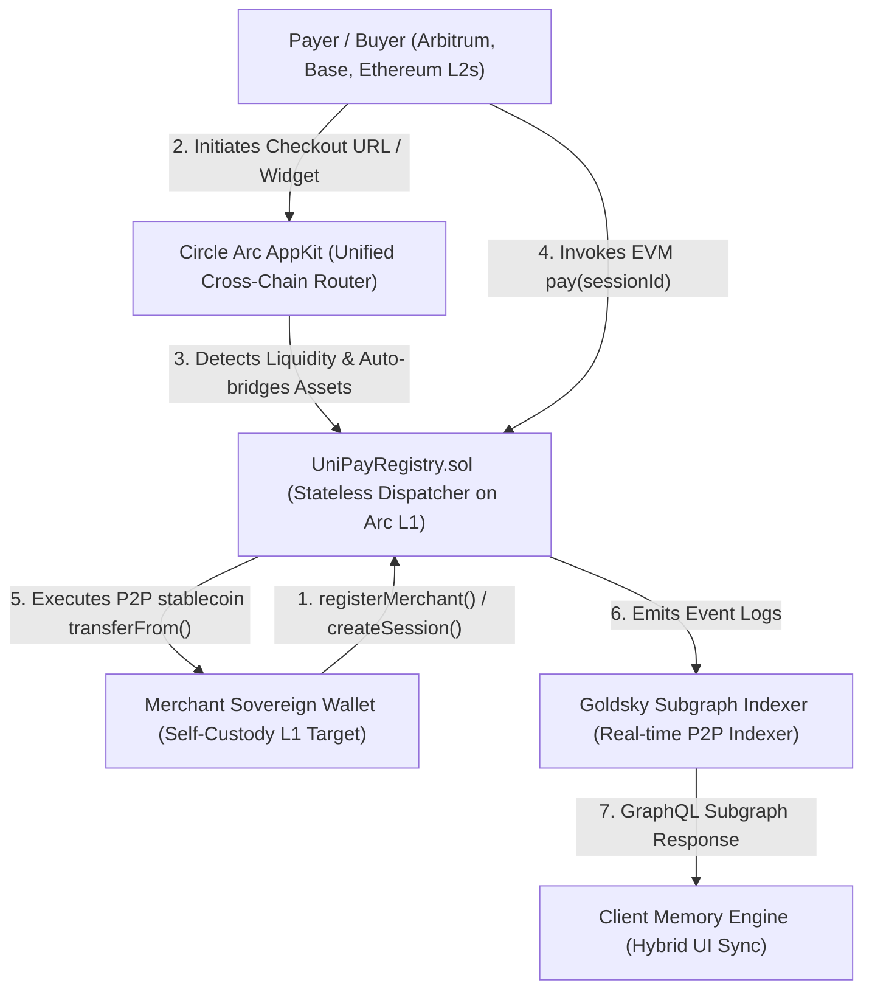

# UniPay — Decentralized Checkout Protocol 🌐💳

> **Stripe-grade Payment Experience Built Natively for Web3.**  
> Accept static or dynamic settlements in **USDC / EURC** from any EVM network, bridge natively to the **Arc Network L1**, and settle directly into your merchant wallet in **&lt; 1 second**.

[](https://nextjs.org)
[](https://www.typescriptlang.org)
[](https://soliditylang.org)
[](https://arc.network)

---

## ⚡ System Architecture & Protocol Mechanics

UniPay operates entirely **without backend servers or centralized proprietary databases**.  
The core verification state machine is a highly optimized, un-upgradable Solidity smart contract (`UniPayRegistry`) deployed natively on the Arc Network blockchain.

### 🏛️ High-Level Component Flow Diagram



### ⚙️ Protocol Architecture Lifecycle

1. **Stateless Immutable Execution**:
   - Zero centralized database footprint. Commercial state variables (`merchants` profiles and `sessions` lifecycle structs) reside entirely within contract L1 memory slots.
2. **Deterministic Hash Invoicing**:
   - Bill payloads generate unique session keys derived securely via `keccak256` hashing of target amounts, dynamic tokens, descriptions, and strict expiry interval integers.
3. **Unified Liquidity & Cross-Chain Routing**:
   - Integrated over native **Circle Arc AppKit** channels, allowing seamless user stablecoin abstraction. Buyers hold assets on any standard Layer-2, while payments flow seamlessly to settle directly into the Arc L1 base architecture.
4. **Sub-second P2P Handshake**:
   - Orders trigger trustless atomic dispatch execution (`pay()`). Funds are deducted and wired directly to the destination merchant self-custodial wallet instantly without platform fees or withholding accounts.
5. **Hybrid Client-State Synchronization Engine**:
   - Next.js dashboards track L1 socket updates (`useWatchContractEvent`) coupled with an optimized local persistent layer (`localStorage`) to guarantee blazing-fast web-grade responsiveness while maintaining absolute cryptographical verification.

### 🛡️ Key Platform Modules:
1. **Merchant Command Center (`/dashboard`)**:
   - Self-custodial namespace deployment with auto-refreshing real-time ledger verification logs.
2. **Dynamic Invoicing Generator (`/dashboard/create`)**:
   - Publish tamper-proof payment specification links mapped directly with custom expiry lifecycles.
3. **Decentralized Audit Archives (`/dashboard/history`)**:
   - Interrogates EVM historical RPC nodes (`eth_getLogs`) to form tamper-evident accounting tables.
4. **Public Registry Explorer (`/explorer`)**:
   - Query decentralized commercial state mapping active validation statuses.
5. **Universal Embedded Widget (`public/widget.js`)**:
   - Drop-in standalone Web Component (`<unipay-checkout>`) enabling zero-dependency multi-chain embedded frames inside external ecosystems (WordPress, React, Vanilla Web).

---

## 🛠️ Technology Stack
- **Frontend Framework**: Next.js 14 (App Router) + TypeScript
- **Styling Engine**: Tailwind CSS + Premium Custom Glassmorphism UI
- **Web3 Adapters**: Wagmi v2 + Viem v2 + Reown AppKit Cross-chain Modals
- **Smart Contract Interface**: Solidity (EVM Bytecode Compliant)
- **Target L1 Node**: Arc Testnet (`Chain ID: 5042002`, `RPC: https://rpc.testnet.arc.network`)

---

## 📦 Local Deployment & Verification

### 1. Environment Setup
Create a `.env` file at root level mapping your explicit environment keys:
```env
NEXT_PUBLIC_REOWN_PROJECT_ID="YOUR_REOWN_PROJECT_ID"
DEPLOYER_PRIVATE_KEY="0xYOUR_TESTNET_PRIVATE_KEY"
```

### 2. Auto-Deploying Smart Contract
Execute our smart pre-compiled Node.js script to push your state machine directly to the Arc Testnet:
```bash
node scripts/deploy.mjs
```
*Note: Upon block confirmation, the script will automatically harvest the resultant permanent contract address and inject it safely into your `src/lib/constants.ts` file.*

### 3. Launching Development Server
Start hot-reloading development instances locally:
```bash
npm install
npm run dev
```
Navigate to `http://localhost:3000` to review rich aesthetic landing sequences.

---

## 🛡️ Production Compliance
This application strictly adheres to production validation parameters. Running compilation audits guarantees clean execution traces:
```bash
npm run build
```
Resultant output routes guarantee highly optimized static server pre-rendering configurations mixed with fast dynamic routes.

---

## 📄 License
Distributed under the **MIT License**. Immutably accessible globally.
